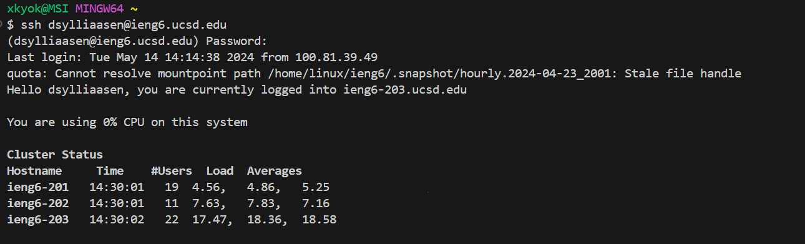
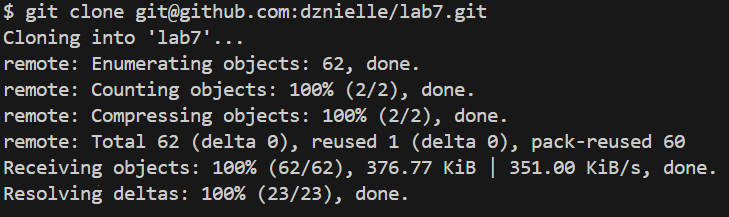

# Lab Report 4

## Step 1

Keys Pressed:

## Step 2

Keys Pressed:

## Step 3
Keys Pressed:

## Step 4
Keys Pressed:

## Step 5
Keys Pressed:

## Step 6
Keys Pressed:

## Step 7
Keys Pressed:

## Step 8
Keys Pressed:

## Step 9
Keys Pressed:


```
  @Test
  public void testReversed1() {
    int[] input1 = {1, 2, 3, 4, 5};
    assertArrayEquals(new int[]{5, 4, 3, 2, 1}, ArrayExamples.reversed(input1));
  }
```

G, k, k, k, k, k, k, shift 6 to get to ^, l, l, l, l, l, a, backspace, type 2, esc, :wq
