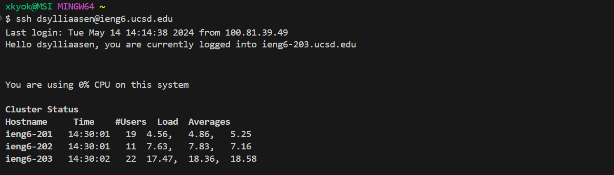
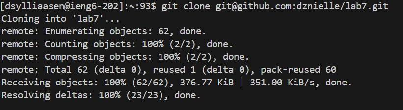
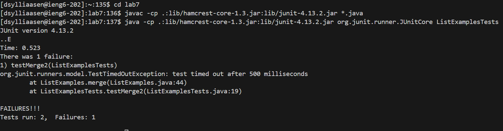
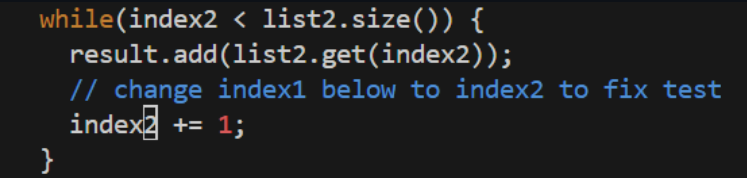
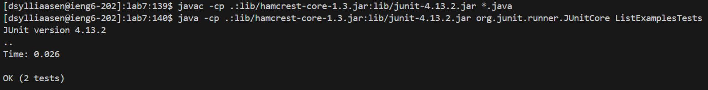
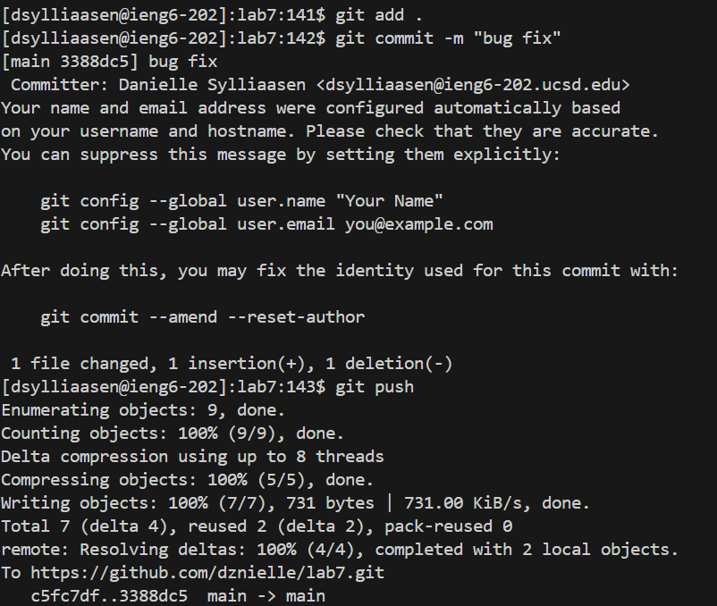

# Lab Report 4

## Step 1 Logging into ieng6

Keys Pressed: `ssh dsylliaasen@ieng6.ucsd.edu` `<enter>`

I typed the `ssh dsylliaasen@ieng6.ucsd.edu` command into the terminal and pressed enter, this allowed me to connect to the ieng6 server.

## Step 2 Cloning

Keys Pressed: `git clone git@github.com:dznielle/lab7.git` `<enter>`

I typed `git clone git@github.com:dznielle/lab7.git` and pressed enter, this allowed me to clone into the lab7 repository.

## Step 3 Test Failures

Keys Pressed: `cd` `<space>` `<lab7>` `<enter>` then, `<ctrl>` `v` `<enter>`, and `<ctrl>` `v` `<enter>`

The first sequence of keys I pressed allowed me to change directories into `lab7`. Then I tabbed out of the terminal to week 4's lab where I found the commands to run tests. I copied `javac -cp .:lib/hamcrest-core-1.3.jar:lib/junit-4.13.2.jar *.java` to my clipboard and used `<ctrl>` `v` `<enter>` to paste the command and run it. I did this process again with `java -cp .:lib/hamcrest-core-1.3.jar:lib/junit-4.13.2.jar org.junit.runner.JUnitCore ListExamplesTests`. THe commands I ran allowed me to run the tests for ListExamples.

## Step 4 Editing Code
Command Line

Edited code in vim

Keys Pressed:  `<ctrl>` `v` `<enter>` then in vim, `<shift>` `g` `kkkkkkk^llllla` `<backspace>` `2` `<esc>` `:wq` `<enter>`

I had the command `vim ListExamples.Java` copied to my clipboard and did the paste shortcut. This command allows me to edit the file through vim. Then, once I was editing through vim, I pressed `<shift>` `g` to go to the bottom of the file since the g has to be uppercase. Then, I did `k` 6 times to get to the 44th line. Then `^` goes to the first word in the line. After that, I did `l` 5 times to get to the `1` in `index1`. I did `a` to append to the line, then used `<backspace>` to delete the `1` in `index1`. Then, I pressed `2` to replace the number I deleted. Then I pressed `<esc>` to go to normal mode and saved my changes and exited through `<:wq>` `<enter>`.

## Step 5 Test Successes

Keys Pressed: `<up>` `<up>` `<up>`  `<enter>` then, `<up>` `<up>` `<up>`  `<enter>`

The `javac -cp ".;lib/hamcrest-core-1.3.jar;lib/junit-4.13.2.jar" *.java` command was 3 up in my search history, so I used the up arrow key to access it. Then, the `java -cp ".;lib/junit-4.13.2.jar;lib/hamcrest-core-1.3.jar" org.junit.runner.JUnitCore ListExamplesTests` command was then also 3 up, so I accessed it in the same process. These commands allow me to run the tests for ListExamples.

## Step 6 Commit and Push

Keys Pressed: `git add .` `<enter>` , `git commit -m "bug fix"` `<enter>`, `git push` `<enter>`

`git add .` adds the changes made to lab7 to the staging area. `git commit -m "bug fix"` commits the changes to the repository.  `git push` makes the changes visible on GitHub.
