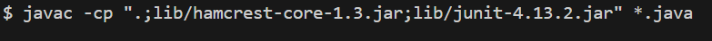
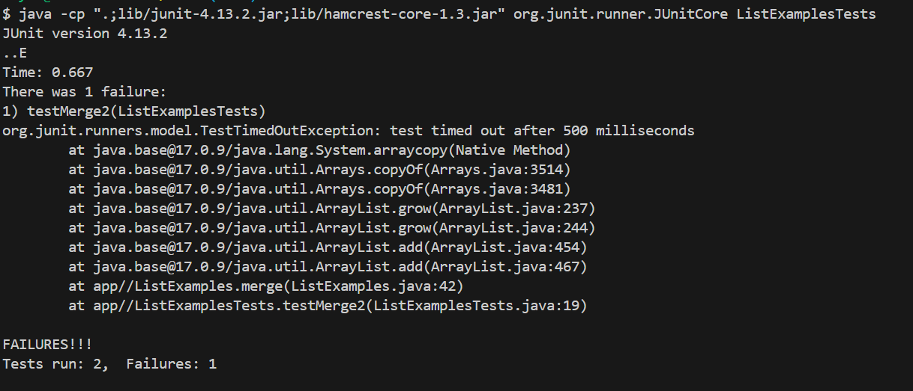
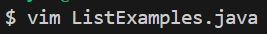
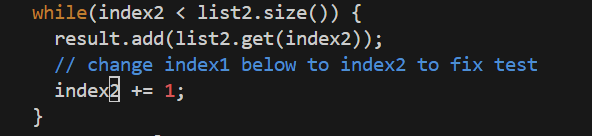

# Lab Report 4

## Step 1 Logging into ieng6


Keys Pressed: `<ctrl>` `<v>` `<enter>`

I copied the `ssh dsylliaasen@ieng6.ucsd.edu` command to my clipboard prior to typing, and used the CTRL + V shortcut to access the command.

## Step 2 Cloning


Keys Pressed: `<ctrl>` `<v>` `<enter>`

I  copied the command `git clone git@github.com:dznielle/lab7.git` to my clipboard before typing so I did the paste shortcut, CTRL + V to access the command.

## Step 3 Test Failures



Keys Pressed: `<up>` `<up>` `<up>` `<up>` `<up>` `<up>` `<enter>` then, `<up>` `<up>` `<up>` `<up>` `<up>` `<up>` `<enter>`

The `javac -cp ".;lib/hamcrest-core-1.3.jar;lib/junit-4.13.2.jar" *.java` command was 5 up in my search history, so I used the up arrow key to access it. Then, the `java -cp ".;lib/junit-4.13.2.jar;lib/hamcrest-core-1.3.jar" org.junit.runner.JUnitCore ListExamplesTests` command was then 5 up, so I accessed it in the same process.

## Step 4 Editing Code



Keys Pressed:  `<ctrl>` `<v>` `<enter>` then in vim, `<G>` `<k>` `<k>` `<k>` `<k>` `<k>` `<k>` `<^>` `<l>` `<l>` `<l>` `<l>` `<l>` `<a>` `<backspace>` `<2>` `<esc>` `<:>` `<w>` `<q>` `<enter>`

I had the command `vim ListExamples.Java` copied to my clipboard and did the paste shortcut. Then, once I was editing through vim, I pressed `<G>` to go to the bottom of the file. Then, I did `<k>` 6 times to get to the 44th line. Then `<^>` goes to the first word in the line. After that, I did `<l>` to get to the `1` in `index1`. I did `<a>` to append to the line, then used `<backspace>` to delete the `1` in `index1`. Then, I pressed `<2>` to replace the number I deleted. Then I pressed `<esc>` to go to normal mode and saved my changes and exited through `<esc>` `<:>` `<w>` `<q>` `<enter>`.

## Step 5 Test Successes
Keys Pressed:

## Step 6 Commit and Push

```
  @Test
  public void testReversed1() {
    int[] input1 = {1, 2, 3, 4, 5};
    assertArrayEquals(new int[]{5, 4, 3, 2, 1}, ArrayExamples.reversed(input1));
  }
```

G, k, k, k, k, k, k, shift 6 to get to ^, l, l, l, l, l, a, backspace, type 2, esc, :wq
